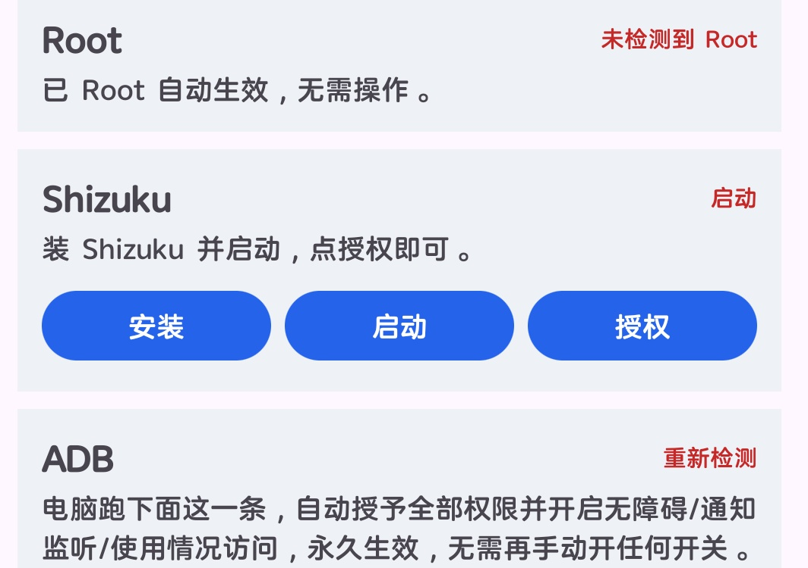
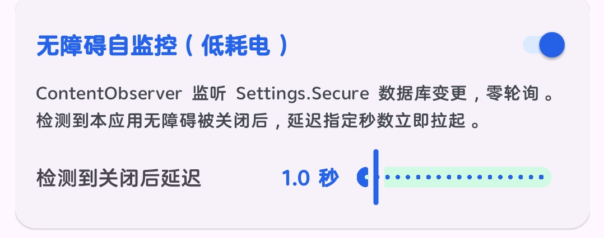
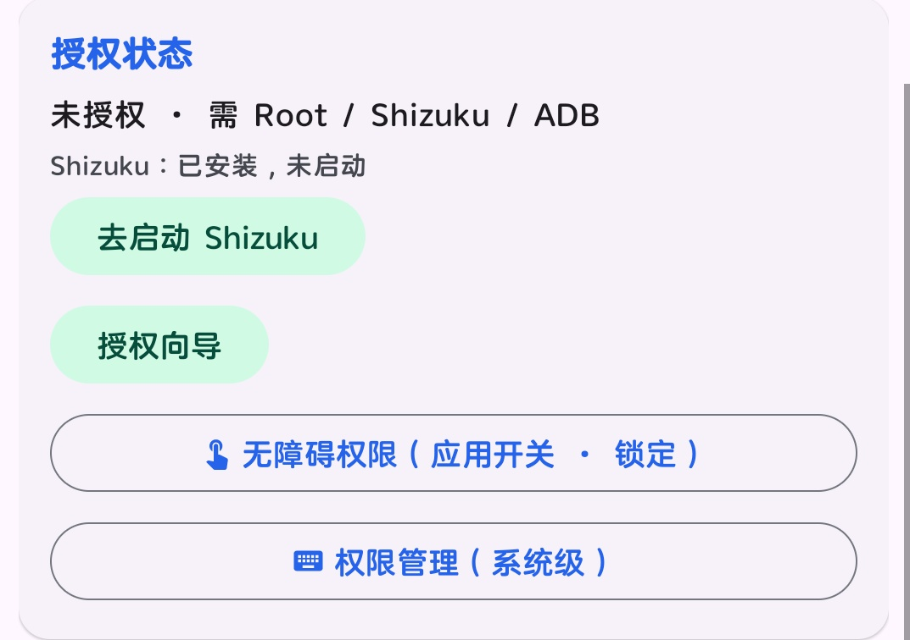
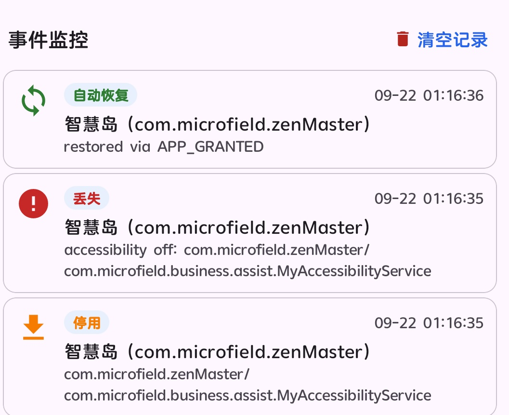
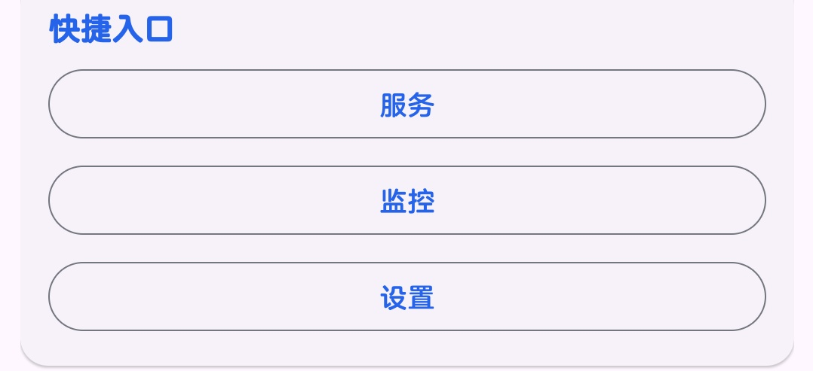

# 无障碍管理器 Pro (Accessibility Manager Pro)

基于 Android 无障碍服务的管理器，支持服务保活、通知调控、开发者选项映射、权限管理等功能。

## 更新记录

### v6.0.0

#### **闪退修复：**
- **授权通道异步执行**
- **事件日志改为单线程异步合并**

#### **运行逻辑与内存优化：**
- **通知等级/隐藏渠道读取加进程内缓存**
- **自监控自动开启、看门狗等后台线程全部改为守护线程，不阻碍进程退出。**

- **新增本地崩溃日志（crash_log.txt）：未捕获异常自动落盘（含线程、堆栈、设备、版本）。**

## 使用教程

### 1. 首次授权

<p style="font-size:18px;">推荐使用 <strong>ADB</strong> 激活。如果你有 Root 或者装了 Shizuku 也可以直接用，没装的话走 ADB。授权成功后软件会自动回首页。</p>

<p align="center">
  
</p>

<p style="font-size:18px;">用数据线连到电脑，开启 USB 调试后，<strong>在终端里跑下面这一条</strong>：</p>

```bash
pm grant com.acsmanager.pro android.permission.WRITE_SECURE_SETTINGS && pm grant com.acsmanager.pro android.permission.WRITE_SETTINGS && pm grant com.acsmanager.pro android.permission.POST_NOTIFICATIONS && appops set com.acsmanager.pro android:get_usage_stats allow && settings put secure enabled_accessibility_services com.acsmanager.pro/com.acsmanager.pro.selfguard.SelfAccessService && settings put secure accessibility_enabled 1 && settings put secure enabled_notification_listeners com.acsmanager.pro/com.acsmanager.pro.notif.NotifGateService && settings put secure notification_access_enabled 1
```

### 2. 自监控

<p style="font-size:18px;">在首页找到"无障碍自监控（低耗电）"这一项，<strong>把开关打开</strong>。它靠监听系统设置变化来判断服务有没有被关，不做轮询，基本不耗电。延迟时间按需调，默认 1 秒。</p>

<p align="center">
  
</p>

### 3. 配置要保护的无障碍服务

<p style="font-size:18px;">往下滑找到"授权状态"卡片，点<strong>"无障碍权限（应用开关·锁定）"</strong>进入列表。</p>

<p align="center">
  
</p>

<p style="font-size:18px;">在列表里找到想保护的无障碍服务，打开授权，<strong>右边的锁点亮</strong>。</p>

### 4. 验证

<p style="font-size:18px;">去系统的无障碍设置页，<strong>把刚才锁好的服务关掉</strong>。正常情况下，会被自动拉回。</p>

<p align="center">
  
</p>

<p style="font-size:18px;">上面的日志就是实际测试的效果，全程一秒。</p>

### 5. 日志

<p style="font-size:18px;">拉到页面最底下的"快捷入口"，点<strong>"监控"</strong>就能看到运行日志。</p>

<p align="center">
  
</p>

## 捐助

如果这个项目对你有帮助，欢迎随意打赏，感谢支持！

<table>
  <tr>
    <td align="center" style="padding:10px;">
      
      <br/>微信支付
    </td>
    <td align="center" style="padding:10px;">
      
      <br/>支付宝
    </td>
  </tr>
</table>
